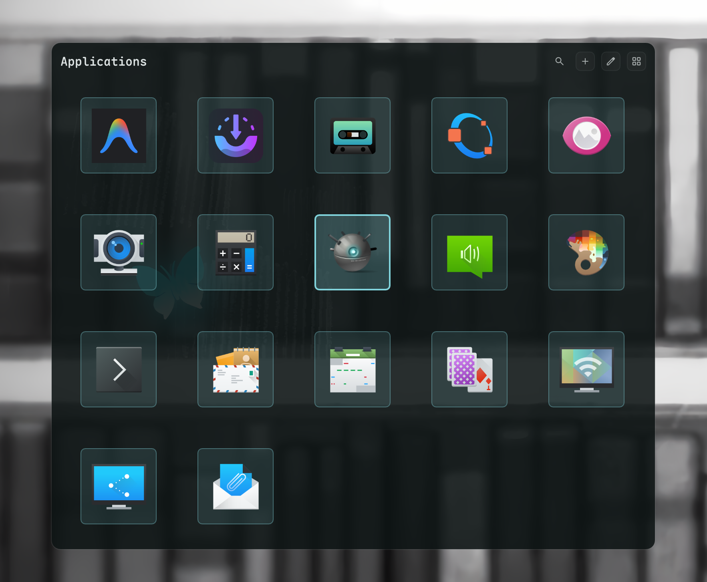

# App Launcher

An application launcher widget for DankMaterialShell (DMS) to search and launch applications.



## Install

Use the DMS CLI:
```bash
dms plugins install appLauncher
```

Or manually:
```bash
git clone https://github.com/hthienloc/dms-app-launcher ~/.config/DankMaterialShell/plugins/appLauncher
```

## Features

- **App Discovery** - Scans standard system applications, user overrides, Flatpaks, and Snaps.
- **In-Widget App Scanner** - Add or remove application shortcuts with Wayland keyboard support.
- **Tactile Click Feedback** - Snappy spring scale-bounce and primary border highlight on hover.

## Usage

| Action | Result |
|--------|--------|
| Left Click App Icon | Launch application with tactile feedback |
| Left Click Group | Expand group to view apps inside |
| Middle Click Group | **Launch all** apps within the group simultaneously |
| Middle Click Background | Open in-widget manager to add, group, or remove shortcuts |
| Search Bar | Type to filter applications instantly (supports group navigation) |


## License

GPL-3.0

## Roadmap / TODO

- [x] **Size Cycle Button:** Dynamic scaling button in the header toolbar.
- [x] **Flatpak & Snap Scanning:** Support Flatpak and Snap sandboxes.
- [x] **Tactile Animations:** Snappy scale-bounce feedback on click.
